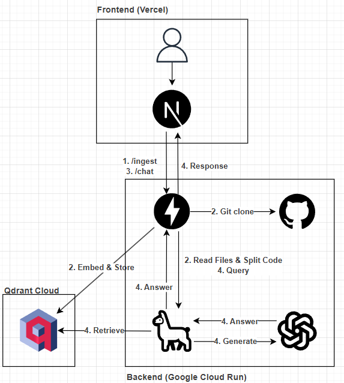

# GitHubリポジトリ対話システム (GitHub Repo Q&A)

指定したGitHubリポジトリのコードベース全体を取り込み、自然言語で仕様やロジックについて質問できるRAG（Retrieval-Augmented Generation）アプリケーションです。

## 概要

ユーザーはリポジトリのURLを入力するだけで、そのコードベースに関する質問（例：「`XXX` 関数の役割は？」）をチャット形式で行うことができます。

## デモ

https://github-repo-rag-git-main-ku6kaws-projects.vercel.app/

## 特徴

* **リポジトリの取り込み (Ingestion):** GitHub URLを指定すると、バックエンドがリポジトリをクローンし、コードファイル（`.py`, `.md` など）を解析・チャンク化してベクトルDBに保存します。
* **コードベースとの対話 (Q&A):** RAGパイプライン（LlamaIndex）を通じて、取り込まれたリポジトリの内容に基づいた回答をLLM（OpenAI）が生成します。

## 技術スタック

| コンポーネント | 技術 |
| :--- | :--- |
| **フロントエンド** | Next.js (TypeScript, React), Tailwind CSS |
| **バックエンド (API)** | FastAPI (Python) |
| **RAGフレームワーク** | LlamaIndex |
| **ベクトルDB** | Qdrant (Cloud / Docker) |
| **LLM & Embedding** | OpenAI (GPT-4o, text-embedding-3-small) |
| **デプロイ (F/E)** | Vercel |
| **デプロイ (B/E)** | Docker + Google Cloud Run |
| **その他** | uv (Python環境), Google Artifact Registry |


## アーキテクチャ




-----

## ローカルでの実行方法

### 1\. 必要なもの

  * [Docker Desktop](https://www.docker.com/products/docker-desktop/)
  * [Node.js (v18+)](https://nodejs.org/)
  * [uv](https://github.com/astral-sh/uv) (Pythonパッケージ管理)
  * OpenAI APIキー
  * (オプション) [Google Cloud SDK (gcloud)](https://cloud.google.com/sdk/docs/install)

### 2\. 環境構築

**A. リポジトリのクローン**

```bash
git clone [https://github.com/](https://github.com/)[YOUR_USERNAME]/[YOUR_REPO_NAME]
cd [YOUR_REPO_NAME]
```

**B. 環境変数の設定**

1.  **バックエンド用:** `fastapi-backend/` に `.env` ファイルを作成します。
    ```ini
    # fastapi-backend/.env
    OPENAI_API_KEY="sk-..."

    # ローカル開発時は以下をコメントアウト（または空）にしてローカルDBを参照
    # QDRANT_URL=""
    # QDRANT_API_KEY=""
    ```
2.  **フロントエンド用:** `frontend/` に `.env.local` ファイルを作成します。
    ```ini
    # frontend/.env.local
    NEXT_PUBLIC_API_URL=http://localhost:8000
    ```

**C. ライブラリのインストール**

1.  **バックエンド (Python)**
    ```bash
    cd fastapi-backend

    # 仮想環境の作成
    uv venv
    source .venv/bin/activate

    # 依存ライブラリのインストール
    uv pip install -r requirements.txt
    ```
2.  **フロントエンド (Node.js)**
    ```bash
    cd ../frontend
    npm install
    ```

### 3\. ローカルサーバーの起動

**ターミナルを3つ**開いて実行します。

**ターミナル 1: データベース (Qdrant) 🗄️**
(プロジェクトのルートで実行)

```bash
docker run -p 6333:6333 -p 6334:6334 \
       -v $(pwd)/qdrant_storage:/qdrant/storage \
       qdrant/qdrant
```

**ターミナル 2: バックエンド (FastAPI) 🚀**

```bash
cd fastapi-backend
source .venv/bin/activate
uvicorn app.main:app --host 0.0.0.0 --port 8000 --reload
```

**ターミナル 3: フロントエンド (Next.js) 🖥️**

```bash
cd frontend
npm run dev
```

ブラウザで `http://localhost:3000` にアクセスします。

-----

## デプロイ

このアプリケーションは、以下のサービスにデプロイされています。

### 1\. データベース (Qdrant Cloud)

  * [Qdrant Cloud](https://cloud.qdrant.io/) で無料枠のクラスターを作成。
  * 取得した `QDRANT_URL` と `QDRANT_API_KEY` をバックエンドの環境変数として設定。

### 2\. バックエンド (Google Cloud Run)

1.  `fastapi-backend/` 内の `Dockerfile` を使用してコンテナイメージをビルド。
2.  Google Artifact Registry にイメージをプッシュ。
    ```bash
    # ビルド
    docker build -t [IMAGE_NAME] .
    # プッシュ
    docker push [IMAGE_NAME]
    ```
3.  Cloud Run にデプロイ。`git` のインストールに失敗する場合は `Dockerfile` を、メモリ不足の場合は `--memory` オプションを調整してください。
    ```bash
    gcloud run deploy rag-api-backend \
        --image=[IMAGE_NAME] \
        --platform=managed \
        --region=asia-northeast1 \
        --allow-unauthenticated \
        --port=8080 \
        --memory=512Mi \
        --set-env-vars=^::^OPENAI_API_KEY=...::QDRANT_URL=...::QDRANT_API_KEY=...
    ```

### 3\. フロントエンド (Vercel)

1.  このリポジトリをVercelにインポート。
2.  **Root Directory** を `frontend` に設定。
3.  **Environment Variables** に `NEXT_PUBLIC_API_URL`（Cloud RunのURL）を設定。
4.  「Deploy」を実行。

## ライセンス

This project is licensed under the MIT License - see the `LICENSE` file for details.

